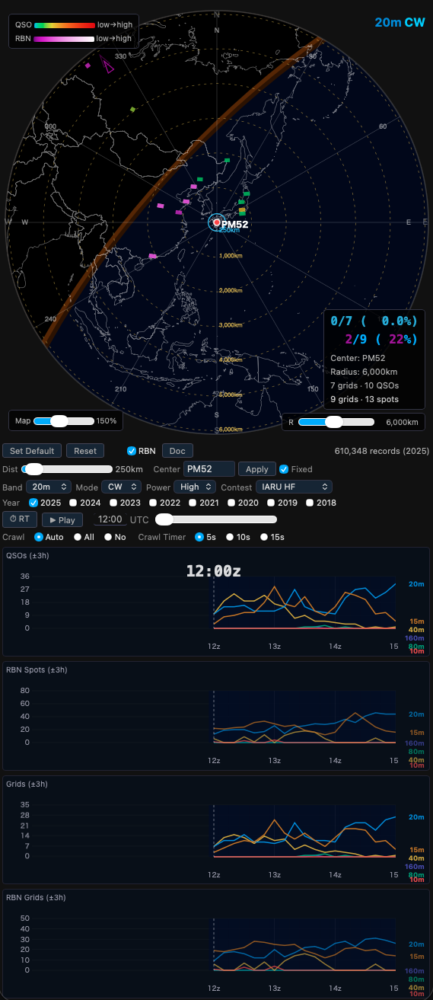
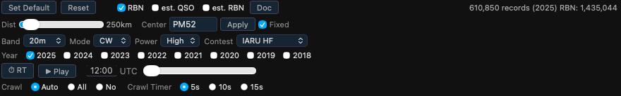
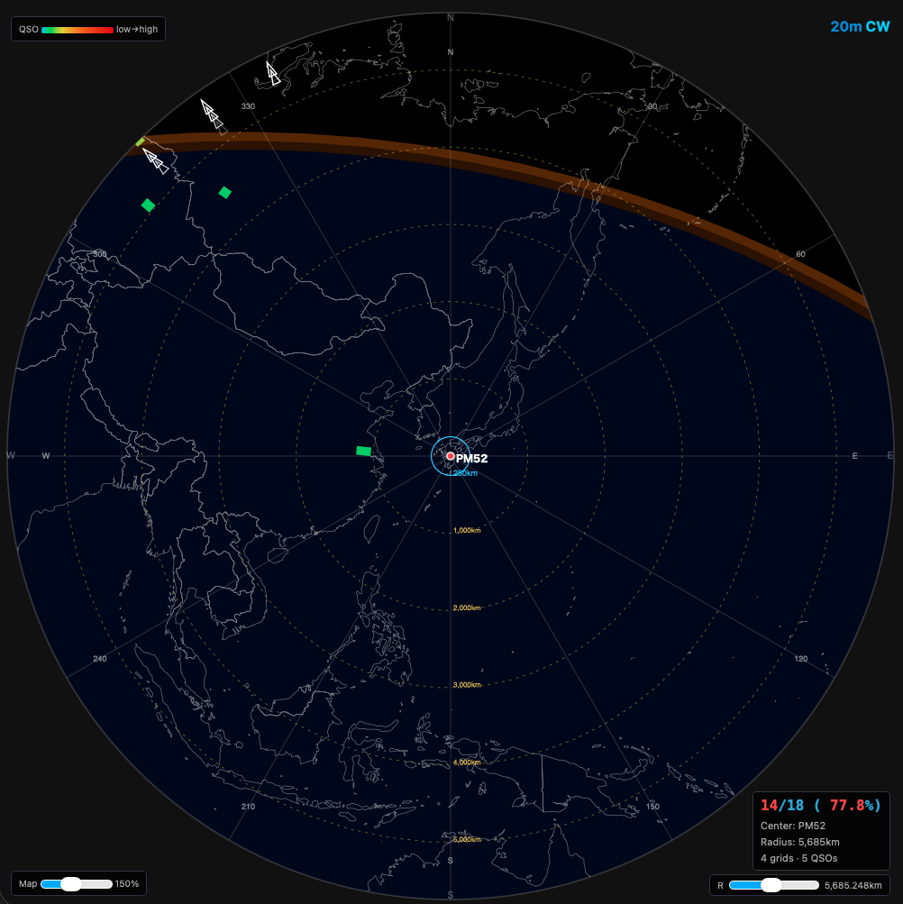
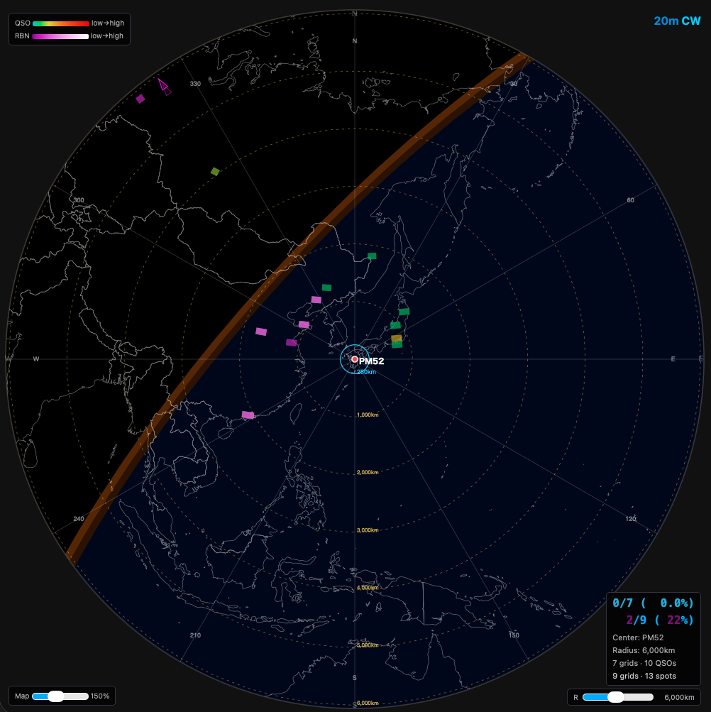
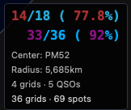
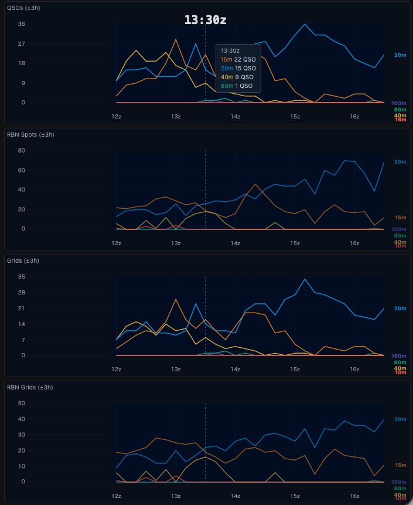
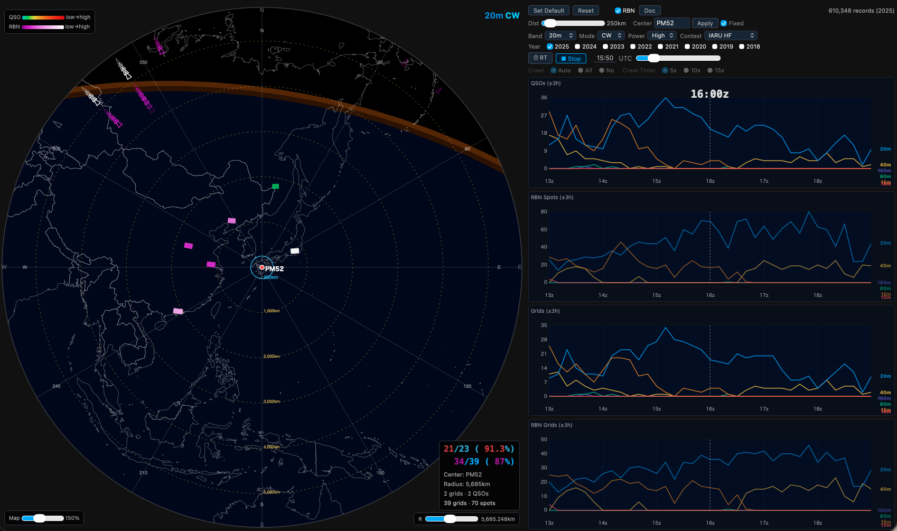

# PropMap ユーザーガイド

---

## 1. はじめに

### PropMapとは

PropMapは、アマチュア無線コンテストの公開ログデータおよび RBN（Reverse Beacon Network）スポットデータを集約し、指定したグリッドロケーターを中心とした大圏方位図（Azimuthal Equidistant Map）上に、過去の HF 帯の電波伝搬状況をヒートマップとして可視化するツール。過去のデータをベースとしていて、同時期のコンテストでの電波伝播状況の傾向の把握に有用。過去データの再生そして、実時間に過去データの時間を合わせることでリアルタイムでの同時刻の過去データの参照が可能

コンテスト参加時の運用計画、バンドチェンジのタイミング把握、過去コンテストの伝搬傾向分析、リアルタイム参照が可能

### 動作環境・必要なもの

- macOS Tahoe / Windows 11（動作確認済み）
- Python 3.10 以上（起動スクリプトが自動検出し、無ければ同意制で自動調達を提案するため、通常は事前インストール不要。Xcode / Command Line Tools / Visual Studio などの**開発環境は不要**。手動導入は「[（参考）Python の手動インストール](#参考python-の手動インストール)」参照）
- モダンブラウザ（Safari、Chrome、Edge 等）
- 参照したいコンテストの JSON データファイル（`~/heatmap/data/` に配置済みのこと）。[事前データ準備の章を参照してのデータの作成が必要](#10-事前データ準備)

### 前提条件
- 参照したいコンテストの公開ログの取得
- 公開ログのヘッダ(**GRID-LOCATOR**)での正しいグリッドロケータの記載(4桁あれば必要十分)
- グリッドロケータ未記載の局は cty.dat によるコールサインからの推定値を使用可能（**est. QSO** / **est. RBN** として通常データとは区別して表示）
- 関連する RBN の生データ(RBN から参照する場合)
- RBN で使用するモードは CW のみ
- RBN で使用する spot は公開ログのうちグリッドロケータが記載された局が対象（**est. RBN** では cty.dat 推定値の局も含む）
- 公開ログ間での QSO のクロスチェックに合致し、双方の局のグリッドロケータが判明している QSO のみデータとして採用
- クロスチェックは双方のログに相手局が同一バンド、同一時刻(時間差は 15 分以内)に載っていることとし、ナンバーの整合性は不問
- クロスチェックでのコールサインは完全合致あるいは 2 文字以内の不一致なら合致とみなす
- バンド不一致の場合、それぞれの局のログ時刻から 15 分以内での当該バンドでの QSO 数の多い方を正しいバンドとみなしてバンド訂正する

---

## 2. セットアップ

### 配置

zip を展開（またはリポジトリを clone）し、好きな場所に置く。フォルダ名も任意（`heatmap` である必要はない）。以降の説明では例として `~/heatmap/`（macOS/Linux/WSL2）または `%USERPROFILE%\heatmap\`（Windows、例: `C:\Users\ユーザー名\heatmap\`）を使うが、実際の配置先に読み替えること

### 起動方法

**macOS / Windows (WSL2 あり)**

macOS では `start_heatmap.command` をダブルクリックするか、ターミナルで以下を実行する。ダブルクリックでの起動ではターミナルが開くと同時にデフォルトブラウザが自動で起動されるため個別にブラウザを開く必要はない。開いたターミナルを終了させるとブラウザのウィンドウも閉じる

WSL2 では通常ダブルクリックでの起動ができないため、WSL2 のターミナル（Ubuntu 等）から実行する

```bash
bash ~/heatmap/start_heatmap.command
```

> **macOS の初回のみ:** ダウンロードした zip 由来のファイルは初回起動時にブロックされるため、`start_heatmap.command` を右クリック →「開く」で起動する。2回目以降はダブルクリックで起動できる

> **WSL2 でブラウザが自動で開かない場合:** `wslu`（`sudo apt install wslu`）を導入すると Windows 側の既定ブラウザが自動で開くようになる。未導入でも起動自体は問題なく、その場合はターミナルに表示される URL（`http://localhost:8765/heatmap.html`）を手動でブラウザに入力すればよい

（Python の場所を自分で管理している場合は `python3 ~/heatmap/propmap_server.py` の直接起動でもよい）

**Windows (WSL2 なし)**

`start_heatmap.bat` をダブルクリックするか、コマンドプロンプトから以下を実行する

```
%USERPROFILE%\heatmap\start_heatmap.bat
```

（Python の場所を自分で管理している場合は `python %USERPROFILE%\heatmap\propmap_server.py` の直接起動でもよい）

> **Windows で「発行元を確認できませんでした」という警告が出る場合:** そのまま「実行」をクリックすれば起動する。この警告が毎回出るのを止めたい場合は、展開フォルダで PowerShell を開き以下を実行する（他の `.bat` ファイルも含めてまとめて解除される）:
> ```powershell
> Get-ChildItem -Path "$env:USERPROFILE\heatmap" -Recurse | Unblock-File
> ```
> 「プロパティ→ブロックの解除」チェックボックスは環境によって見当たらないことがあるが、上記コマンドはそれによらず有効

起動後、ブラウザで `http://localhost:8765` にアクセスする

起動スクリプトは利用可能な Python 3.10 以上を自動検出して使用する。見つからない場合はその場で案内が出て、同意すれば **uv** を導入し Python 本体も自動調達するため、**通常は Python の事前インストールは不要**（コンパイラや開発環境も不要）。手動で導入・管理したい場合は「[（参考）Python の手動インストール](#参考python-の手動インストール)」を参照

サーバーは `127.0.0.1` にのみバインドされるため、他のPCからはアクセスできない。従来どおり `python3 -m http.server 8765` で起動しても地図表示は動作するが、その場合「データ更新」機能（下記）は使用できない

> **注意:** ローカルのファイルサーバーが必要であるため、`heatmap.html` をブラウザで直接開いても動作しない

---

### ファイル構成

すべてのファイルは `~/heatmap/`（macOS/Linux/WSL2）または `%USERPROFILE%\heatmap\`（Windows）以下に配置する。リポジトリに含まれるファイルのほか、パイプライン初回実行時に fetch スクリプトが自動取得するファイル（★）とデータ構築スクリプトが生成するファイル（☆）がある。

``` { .no-copy }
~/heatmap/
├── heatmap.html              メインアプリ（単一ファイル完結）
├── update.html               データ更新ページ（構築済みデータ取得・自前構築）
├── propmap_server.py         ローカルサーバー（静的配信 + データ更新API）
├── find_python.sh            Python 自動検出（macOS/Linux/WSL2用）
├── find_python.bat           Python 自動検出（Windows用）
├── start_heatmap.command     起動スクリプト（macOS用）
├── start_heatmap.bat         起動スクリプト（Windows用）
├── countries-50m.json        地形データ
├── fetch_cty.py              cty.dat 一式ダウンロードスクリプト
├── fetch_ssn.py              太陽黒点数データダウンロードスクリプト
├── fetch_rbn_nodes.py        RBNノードリスト生成スクリプト
├── make_data_release.py      構築済みデータのリリース更新（メンテナ用）
├── cty_data/                 ★ cty.dat 一式（fetch_cty.py が取得）
├── data/
│   ├── {contest}_{year}.json         ☆ QSOデータ（10分解像度）
│   └── {contest}_{year}_rbn.json     ☆ RBNデータ（10分解像度）
└── contest_logs/
    ├── raw/{contest}_{year}/*.txt     ☆ 公開されたCabrilloログ
    ├── csv/                           ☆ 処理済みCSVファイル
    │   ├── annotated/{contest}_{year}/  ☆ 注釈付きCabrilloログ（通常）
    │   └── annotated_approx/{contest}_{year}/  ☆ 注釈付きCabrilloログ（approx）
    ├── rbn/
    │   ├── raw/YYYYMMDD.zip           ★ RBN rawデータ（download_rbn.py が取得）
    │   └── rbn_nodes.csv              ★ RBNノードリスト（fetch_rbn_nodes.py が取得）
    ├── SN_m_tot_V2.0.txt              ★ 太陽黒点数データ（fetch_ssn.py が取得）
    ├── *.py                           データ処理スクリプト群
    ├── generate_all.sh                全データ一括再生成スクリプト（macOS/Linux用）
    └── generate_all.bat               全データ一括再生成スクリプト（Windows用）
```

### （参考）Python の手動インストール

通常は起動スクリプトの自動検出・自動調達で足りるため、この節の作業は不要。Python を手動で導入・管理したい場合のみ参照のこと

自動検出の優先順位: 環境変数 `PROPMAP_PYTHON` による明示指定 → PATH 上の `python3`（macOSでは開発者ツール未導入時のスタブを安全に除外）→ 既知のインストール場所（Homebrew / python.org）→ macOS 付属の `python3`（Command Line Tools 導入済みの場合のみ）→ uv

#### macOS Tahoe以降

- **python.org 公式インストーラ（推奨）**: [python.org](https://www.python.org/downloads/) から macOS 用インストーラ（universal2 バイナリ）を取得して実行するだけ。Xcode も Command Line Tools も不要
- **uv**: `curl -LsSf https://astral.sh/uv/install.sh | sh` で導入。Python 本体はスタンドアロンバイナリとして自動取得される（ビルドなし）
- Homebrew を既に利用している場合は `brew install python3` でも可。ただし OS のメジャーアップデート直後は bottle（ビルド済みバイナリ）が未提供でソースビルドにフォールバックし、Xcode を要求されることがあるため、PropMap 目的では上の2方式を推奨する

確認: `python3 --version` で `Python 3.10` 以上が表示されれば成功

#### Windows 11 — WSL2 なし

`heatmap.html`（PropMap 本体）の利用からデータ構築まで、Python for Windows と付属の `generate_all.bat` にて対応。`generate_all.sh` は bash スクリプトのため Windows では直接実行できないため、同等の処理を行う `generate_all.bat` を使用する

1. [python.org](https://www.python.org/downloads/) から Windows 用インストーラを取得する
2. インストール時に **「Add Python to PATH」にチェックを入れる**（デフォルトではオフだが、チェック無しでも付属の `py` ランチャー経由で自動検出される）
3. インストール確認（コマンドプロンプト）: `py -3 --version` または `python --version` で `Python 3.10` 以上が表示されれば成功

なお Microsoft Store 版 Python の「スタブ」（未導入時に `python` と打つとストアが開くエイリアス）は自動検出で安全に除外される

> **注意:** Windows では `python3` ではなく `python` コマンドを使用すること

#### Windows 11 — WSL2 あり

WSL2 環境ではシェルスクリプトをそのまま利用でき、macOS と同等の操作感で使用可能。WSL2 のセットアップ手順は [Microsoft 公式ドキュメント](https://learn.microsoft.com/ja-jp/windows/wsl/install) を参照。Ubuntu インストール後、以下で Python 3 を導入する：

```bash
sudo apt update && sudo apt install -y python3 python3-pip
python3 --version
```
`Python 3.x.x` と表示されれば成功

以降の操作は macOS と同じ。ブラウザは Windows 側で `http://localhost:8765` にアクセスする。

---

## 3. 画面構成


画面は大きく2つのエリアで構成される

**大圏地図エリア（左側 または 上側）**
中心グリッドを起点とした大圏方位図にヒートマップを表示するエリア

**コントロール＋グラフエリア（右側 または 下側）**
表示条件の設定と、±3 時間の QSO 数・グリッド数の時系列グラフを表示するエリア

### レスポンシブレイアウト

ウィンドウ幅に応じてレイアウトが自動的に切り替わる

ブラウザウィンドウが広い場合（デスクトップ・ノートPC等）は大圏地図エリアとコントロール＋グラフエリアが横並び、狭い場合（タブレット縦向き・スマートフォン等、またはウィンドウを縮小した場合）は縦積みに自動切替。



縦積み時は地図幅がウィンドウ幅いっぱいに広がり、グラフ高さは地図高さの 2.2 倍を上限として表示

---

## 4. 基本操作



### 中心グリッドと表示範囲の設定

**Center（中心グリッド）**
4文字のグリッドロケーター（例: PM52）を入力する。入力後、**Apply** ボタンをクリックするか Enter キーで反映される。あるいは大圏地図をドラッグして中心としたい地域を地図の中央に移動させ **Apply** ボタンをクリック

**Dist（表示距離フィルター）**
スライダーで中心グリッドからの距離（km）を設定する。この距離以内に該当する局が存在する QSO・スポットのみが表示対象

**Fixed チェックボックス**

- **チェックあり（デフォルト）**: ドラッグしても地図の見た目だけが動き、ヒートマップは更新されない。Apply を押した時点でヒートマップが新しい中心に合わせて再描画される
- **チェックなし**: ドラッグに合わせてヒートマップがリアルタイムに更新される。広い範囲をドラッグすると描画負荷が高くなる

地図をドラッグすると中心グリッド名が地図上にフル輝度で表示される。ドラッグ終了後 3 秒で自動的に薄くなり、グリッドパネルの表示に干渉しにくくなる。

**Pan チェックボックス**

チェックを入れると地図がパンモードになる。

- **ドラッグ**: 投影の中心（Center グリッド）を変えずに地図表示位置を移動する。PM52 が中心でもヨーロッパ方面など表示範囲外の地域を大圏地図の表示円内に引き込んで確認可能
- **Ctrl + スクロール / ピンチ操作**: 表示スケールを変更（ベクター再描画のため画質劣化しない）
  - ズームイン: 現在のカーソル位置を中心に拡大
  - ズームアウト: 縮小により広い範囲を表示。全球が収まった時点でそれ以上の縮小は不可
- **チェックを外す / オーバーレイクリック**: 移動・スケール変更をリセットして元の表示に戻す

パンモードで地図が移動またはスケール変更されている間は、以下の要素は非表示（地図の表示を単純化）:

| 非表示になるもの | 理由 |
|---|---|
| 中心グリッドマーカー（赤丸・ラベル） | 投影中心が地図の中心から外れるため |
| 距離同心円とラベル | 大圏地図の中心が不明瞭となるため |
| Dist 青丸 | 同上 |
| ベアリング角度ラベル（N/30/60/E…） | 方位線は残ったまま |
| 圏外グリッドの三角マーク | 大圏地図の中心が不明瞭となるため |

### コンテスト・バンド・モード・パワーの選択

| 項目 | 説明 |
|---|---|
| Band | 表示するバンドを選択（160m / 80m / 40m / 20m / 15m / 10m / All (バンド混合)） |
| Mode | 表示するモードを選択（CW / SSB / All (モード混合)） |
| Power | フィルタリングするパワークラス（High / Low / QRP） |
| Contest | 表示するコンテストを選択 |

モード固定のコンテストではそのモード以外の選択は不可

### 年の選択と複数年マージ

**Year** の各チェックボックスで表示する年を選択。複数年を同時にチェックするとデータをマージして重ね合わせ表示する。複数年マージは過去の傾向を総合的に把握する際に有効。公開ログの古いものについてはグリッドロケータの情報がないものが多いためヒートマップに何も表示されないものについてはこのあたりの背景を理解しておくとよい。このような局を補完表示したい場合は **est. QSO** チェックボックスを参照

画面右上に読み込んだレコード数と年が表示される（例: `1,916,313 records (2025)`、`1,052,123 records (2024+2025)`）

### 時刻スライダーの操作

スライダーを左右にドラッグして表示時刻を変更する。UTC時刻が左側のテキストボックスに表示される。テキストボックスに直接時刻（例: `14:30`）を入力してフォーカスを外すあるいは Enter キーで入力するとスライダーがその時刻に移動する

48時間コンテスト（CQ WW、CQ WPX、WAE DX）では **+1d** チェックボックスが表示される。チェックを入れると2日目（コンテスト開始から24時間後以降）の時刻に切り替わる

### Set Default / Reset / Apply

| ボタン | 動作 |
|---|---|
| **Set Default** | 現在の設定（中心グリッド、表示距離など）をデフォルトとして保存 |
| **Reset** | 設定をデフォルトに戻す |
| **Apply** | Center の変更を反映 |
| **Doc** | 操作ガイドをブラウザの言語設定に応じて別タブで開く（日本語または英語） |

---

## 5. 表示モード

### 通常表示（スライダー手動操作）

スライダーを手動で動かして任意の時刻の伝搬状況を確認するモード。大圏地図に表示されるグリッドパネルとグラフは指定した時刻に連動して更新

### Play（自動再生）

**▶ Play** ボタンをクリックするとコンテスト開始時刻からスライダーが自動的に進み、伝搬の変化をアニメーションで確認可能。再生中は **■ Stop** ボタンで停止

任意の時刻から再生が可能で、48時間コンテストでは **+1d** チェックを入れた状態で Play すると2日目から再生

### RT（リアルタイム）

**⏱ RT** ボタンをクリックすると現在のUTC時刻に同期してデータを表示。コンテスト開催中に現時刻に同期させての伝搬状況が確認可能

48時間コンテストでは **+1d** チェックボックスで1日目・2日目を切り替える。コンテスト実施週末の当日は自動的に正しい日に切り替わる

---

## 6. 大圏地図の見方



### 大圏方位図とは

大圏方位図（Azimuthal Equidistant Map）は、中心グリッドからの距離と方位が正確に表現される地図投影法。中心から任意の点への直線が大圏（最短経路）を表す。同心円は中心からの距離（km）を示す。

### QSOヒートマップ

4文字グリッドロケータ単位で地図上に配置される色付き矩形を**グリッドパネル**と呼ぶ。局が存在するグリッドごとに選択した時刻付近のQSO数を集計してグリッドパネルの色で表示。

- 色は **低（緑）→ 黄 → オレンジ → 高（赤）** のグラデーション
- 画面左上の **QSO** カラースケールバーで色と数量の対応を確認可能

### RBNヒートマップ

CW のモードがあるコンテストのみ表示可能。SSBコンテストに切り替えるとチェックボックスが自動で外れてグレーアウトされる。**RBN** チェックボックスをONにするとRBNスポットデータをマゼンタ系の色のグリッドパネルにて表示



- 色は **低（暗紫）→ マゼンタ → 高（白）** のグラデーション
- 画面左上の **RBN** カラースケールバーで確認可能

### est. QSO / est. RBN（推定グリッドデータ）

2018 年頃までのコンテストログではグリッドロケータ（MY LOCATOR）用のヘッダの多くが空、あるいはヘッダが使用されておらず、パネルとして表示される数がごくわずかあるいは、0 となってしまう。**est. QSO** および **est. RBN** チェックボックスを ON にすることで cty.dat を参照し、コールサインからグリッドロケータを推定表示する。

- **est. QSO**: グリッドロケータ不定局の QSO データを追加表示
- **est. RBN**: グリッドロケータ不定のスポット局の RBN データを追加表示（CW のあるコンテストのみ）

注意事項:

- グリッドロケータの情報は cty.dat で定義されているエンティティ（国・地域）あるいはコールエリアレベルの精度であり、実際の運用場所とは異なる場合がある
- 通常の QSO / RBN データと重複しない
- 右上のレコード数表示に `(+N est.)` として est. データのレコード数を追記

### 圏外グリッドの三角マーク

大圏地図の表示範囲（円）の外側に存在するグリッドは、円の外周上に三角マークとして方位角を示す形で表示。QSOデータは白系、RBNデータはマゼンタ系の三角で表示。est. QSO / est. RBN が有効な場合、est. 分のグリッドも同様に三角マークで表示される。同じ方位に複数のグリッドがある場合は少しずつずらして表示。三角マークは点滅

Pan モードで地図が移動または縮尺が変更されていると非表示

### グレーライン（明暗境界線）

現在時刻の太陽の明暗境界線をオレンジ色の帯で表示。グレーラインは伝搬状況（特に低いバンド）と密接な関係がある

### 右下オーバーレイの見方



右下オーバーレイには以下の情報が表示される

``` { .no-copy }
0/21 (  0.0%)        ← QSO: 圏外グリッド数/総グリッド数（割合）
0/17 (  0%)          ← RBN: 圏外グリッド数/総グリッド数（割合）
Center: PM52
Radius: 20,000km
21 grids · 24 QSOs   ← 表示中のグリッド数とQSO数
17 grids · 23 spots  ← 表示中のRBNグリッド数とスポット数
```

**est. QSO / est. RBN が有効な場合**、est. 分のグリッド数・QSO数・スポット数も合算して表示される。

大きいフォントの数値（分子）は**表示範囲外のグリッド数**を示す。数値が0でない場合は点滅することで円外にデータがあることを示す

各行にマウスカーソルを重ねると詳細情報をツールチップにて表示。オーバーレイ全体をクリックすると表示範囲（Radius）をデフォルト値に戻す

### ツールチップ

大圏地図上のグリッドパネルにマウスカーソルを重ねると、そのグリッドの詳細情報がツールチップにて表示

- **グリッド名**（太字）
- 選択年ごとの QSO 数（例: `2024: 12 QSO`）。複数年選択時は年別に列挙
- RBN 有効時はスポット数をマゼンタ色で追加表示（例: `RBN: 5`）
- **est. QSO / est. RBN が有効な場合**、est. 分の QSO 数・スポット数も含めて表示される

---

## 7. グラフパネルの見方



グラフパネルには以下の4つのグラフを表示。いずれも**現在表示時刻の±3時間**の範囲が対象

### QSOs (±3h)

コンテストログをベースにした時刻ごとのQSO数をバンド別の折れ線グラフで表示。縦の点線が現在表示時刻となる

### RBN Spots (±3h)

RBNスポットデータをベースにした時刻ごとのスポット数をバンド別の折れ線グラフにて表示

### Grids (±3h)

コンテストログをベースにした時刻ごとのアクティブグリッド数（ユニークなグリッド数）をバンド別に表示

### RBN Grids (±3h)

RBNスポットデータをベースにした時刻ごとのアクティブグリッド数をバンド別に表示

### バンド別カラー

| バンド | 色 |
|---|---|
| 10m | 赤 |
| 15m | オレンジ |
| 20m | 青 |
| 40m | 黄 |
| 80m | 緑 |
| 160m | 紫 |

### ツールチップ

グラフ上にマウスカーソルを重ねるとその時刻のバンド別数値がツールチップにて表示

---

## 8. Crawlモード（バンド自動巡回）



[RT（リアルタイム）](#rtリアルタイム)表示中に設定した時間間隔で表示バンドを自動的に切り替えることで巡回させるモード

### Auto / All / No の違い

| 設定 | 動作 |
|---|---|
| **Auto** | 現在時刻のデータから、中心グリッド周辺に届いているQSOが全体の15%以上を占めるバンドのみ多い順に巡回。アクティブなバンドに絞った効率的な確認が可能 |
| **All** | 全バンド（10m / 15m / 20m / 40m / 80m / 160m）を順番に巡回 |
| **No** | 自動巡回せず、バンドとモードは固定のまま |

モード固定のコンテスト（CW専用・SSB専用）では、Crawlの巡回対象もそのモードのみとなり、他のモードには切り替わらない

### 巡回タイマーの設定

**Crawl Timer** で各バンドの表示時間を選択する（5秒 / 10秒 / 15秒）

---

## 9. データについて

### 対応コンテストと収録期間

| コンテスト | 開催時期 | 時間 | RBNデータ |
|---|---|---|---|
| IARU HF | 7月第2 full weekend（土曜 12Z 開始） | 24時間 | あり |
| CQ WW CW | 11月最終 full weekend（土曜 00Z 開始） | 48時間 | あり |
| CQ WW SSB | 10月最終 full weekend（土曜 00Z 開始） | 48時間 | なし |
| CQ WPX CW | 5月最終 full weekend（土曜 00Z 開始） | 48時間 | あり |
| CQ WPX SSB | 3月最終 full weekend（土曜 00Z 開始） | 48時間 | なし |
| WAE DX CW | 8月第2 full weekend（土曜 00Z 開始） | 48時間 | あり |
| WAE DX SSB | 9月第2 full weekend（土曜 00Z 開始） | 48時間 | なし |

### WAE DX コンテストを見るときの注意

WAE DX コンテストは、**ヨーロッパの局と、ヨーロッパ以外の局との間でしか交信が成立しない**規則になっている。ヨーロッパ同士、ヨーロッパ以外同士の交信は行われない。

そのため、このコンテストを選んだときの表示は他のコンテストと性質が異なる。

- 日本を中心にした場合、**表示されるのはヨーロッパ方向だけ**になる。北米・オセアニア・アジア方向は空白になる
- ヨーロッパを中心にした場合は、ヨーロッパ以外の全方向が表示され、ヨーロッパ域内だけが空白になる

**この空白は「電波が届かなかった」という意味ではない**。そもそも交信が行われない組み合わせなので、データが存在しない。伝搬状況の比較に使う場合は、この点を踏まえて読むこと。

RBNヒートマップも同じ区分に合わせてあり、ヨーロッパとヨーロッパ以外の間の経路だけを表示する。QSOヒートマップと見え方を揃えるための処理で、他のコンテストではこの絞り込みは行われない。

### RBNデータについて

RBN（Reverse Beacon Network）は、CWやデジタルモードの信号を自動受信・デコードしてスポットするネットワーク。PropMapではRBNスポットデータを用いて、コンテストログに記録されていない伝搬状況も可視化する。RBNデータはCWコンテスト（IARU、CQ WW CW、CQ WPX CW、WAE DX CW）でのみ利用可能

### SSN（太陽黒点数）について

`SN_m_tot_V2.0.txt`（SILSOが提供する月別太陽黒点数データ）を使用してコンテスト開催月のSSNを自動解決し、データ処理時に活用する想定（現状 SSN は RBN ペア CSV のメタデータフィールドとして記録されているが、ヒートマップ表示への直接の影響はなく、この値の利用は未実装）。ファイルが存在しない場合はデータ構築時に自動的にダウンロードされる

---

## 10. 事前データ準備

PropMap を使用するには各種データを事前に用意する必要がある。ツールに含めるにはデータが大きすぎるためで、入手方法は2つある：

- **構築済みデータの取得（推奨）**: プロジェクトが公開している構築済み JSON をダウンロードする。数分で完了する
- **自前構築（上級者向け）**: 公開ログと、該当コンテスト開催日時の RBN raw データから全パイプラインを実行する。構築済みデータがまだ公開されていない年をいち早く取り込みたい場合や検証目的に向く。フル構築は数 GB のダウンロードと数時間の処理を要する

どちらも「データ更新」ページからボタン操作で実行でき、コマンドを打つ必要はない。

**データさえ準備できていれば、以降 PropMap の利用にインターネット接続は不要。** 地図・地形データ（`countries-50m.json`）・ヒートマップ再生は手元のファイルのみで完結する。インターネット接続が必要になるのはデータの準備・更新時のみ

### データ更新ページの開き方

`start_heatmap` で起動したサーバー（propmap_server.py）が動いている状態で、伝播マップの Contest 選択横の「⟳ データ更新」リンクをクリックする。ブラウザで `http://localhost:8765/update.html` を直接開いてもよい

### 構築済みデータの取得（推奨）

データ更新ページの「1. 構築済みデータの取得」で「確認する」をクリックする。配布されているコンテスト×年とサイズの一覧が表示されるので、取得したいものを選択して「選択分をダウンロード」を実行する。取得済みのものは「取得済み」と表示され再取得されない

配布元は GitHub Releases。ダウンロードはサイズ・sha256 検証つきで、途中で失敗しても壊れたファイルが残らない

### 新規開催年の取り込み（自前構築）

構築済みデータがまだ公開されていない開催年を、公開ログと RBN データから自分で構築する

データ更新ページの「2. 公開ログ＋RBNからの自前構築」で「確認する」→ 見積もり表の確認 →「ダウンロードと取り込みを実行」の順にクリックする。対象年は開催日程から自動的に導き出されるため、年を指定する必要はない。実行中も伝播マップは既存データで通常どおり利用でき、完了後に地図タブへ戻ると新しい年が選択肢に現れる。処理はサーバー側で走るためページを閉じても継続する（起動したターミナルを閉じると停止する）

表示される見積もりは「公開ログDLサイズ / RBN zipサイズ / JSON変換後サイズ」の3項目。空き容量が見積もり合計を下回る場合は実行前に中断される

**所要時間について:** 生ログとRBNデータをゼロから取得・処理するため、PCや回線速度によってはコンテスト・年が1件だけでも1時間以上かかることがあり、大規模なコンテストでは数時間に及ぶこともある。進捗表示はステップ名のみで割合（％）は出ないため、長時間見た目が変化しなくても正常な処理中であることが多い

**中断・再開について:** PCのスリープ・シャットダウンやウィンドウを閉じるなどで処理が中断した場合、再度「確認する」→「ダウンロードと取り込みを実行」を行うと、完了済みのステップは再実行せず未完了の部分から再開する。ダウンロード中のファイルが中断された場合も、不完全なファイルが「完了」として扱われることはなく、次回実行時に正しく再取得される

### コマンドラインからの操作

同じ準備作業はコマンドラインからも行える。`contest_logs/` 以下の各スクリプトが `--help` に使い方を持っているので、そちらを参照すること。本ガイドでは扱わない

---

## 11. トラブルシューティング

### `heatmap.html` をブラウザで直接開いてもデータが表示されない

`file://` プロトコルではブラウザのセキュリティ制限により JSON データの読み込みがブロックされる。必ずローカルサーバー経由でアクセスすること（[起動方法](#起動方法) 参照）

### パネルが1件も表示されない

以下の順で確認する。

1. **コンテスト・年・フィルター設定の確認**  
   Band / Mode / Dist / Year の選択が意図したものになっているか確認する。特に Dist が小さすぎると表示対象が少なくなる

2. **データの有無の確認**  
   「データ更新」ページの「1. 構築済みデータの取得」で「確認する」をクリックし、そのコンテスト・年が「取得済み」になっているか確認する。なっていなければ選択してダウンロードする

上記でも表示されない場合は、そのコンテスト・年・条件に該当する QSO が存在しない可能性がある。年や Dist を変えて確認する

### est. データが表示されない

そのコンテスト・年の推定データ（`*_approx.json`）が手元に無い。「データ更新」ページの「1. 構築済みデータの取得」から該当のコンテスト・年を取得し直す。配布データには推定データも含まれている

### アニメーション（点滅）やドラッグ操作がカクつく・止まる、Play が間引かれる

- PropMap のタブをバックグラウンドにするとブラウザのタイマー制限により点滅が一時停止する。これはブラウザの仕様であり不具合ではない
- 他タブ・ウィンドウで重い処理（動画・WebGL 等）を開いている場合、CPU リソース競合によりカクつくことがある。PropMap タブをアクティブにし、他の重いページを閉じると改善する
- 地図をドラッグして中心を変更する操作（**Fixed** チェックなし時や **Pan** モード）も連続的な再描画を伴うため、同様に他タブでのCPU競合があるとカクつくことがある。対処は上記と同じ
- 他タブを閉じても改善しない場合、PC 自体の空きメモリ・CPU に余裕が無いことが原因のことがある。特に複数年マージ表示や、CQ WW / CQ WPX のようなデータ量の多いコンテスト（JSON ファイルが1件で200MB超になることもある）を選択している場合、扱うデータ量が大きくブラウザの負荷が上がる。**Play** での自動再生時にコマ落ちする場合はこれが原因であることが多く、対象年を絞る・Dist（表示距離）を狭める・他のアプリを終了するなどでブラウザの負荷を下げると改善する

### 初回読み込みが遅い

JSON ファイルは 1 ファイルあたり数十〜200MB 超になる場合があり、初回読み込みに数秒かかることがある。これはデータ量に起因するものであり、2 回目以降はブラウザキャッシュが効く

### ブラウザ互換性

Chrome / Safari / Edge で動作確認済み。Firefox でも動作するが、大量データ処理時のパフォーマンスに差が出ることがある

### スマートフォン・タブレットでの利用

動作確認・使用を想定していない。PC ブラウザでの利用を前提とする

---

## 12. Tips

### 一度止めて再度起動した後、開いたままのページはどうなるか

`start_heatmap` を一度止めてからまた起動しても、開いたままのブラウザタブ（`heatmap.html` / `update.html`）をわざわざ閉じて開き直す必要はない。年やコンテストを選び直すなど何か操作すれば、また普通に動くようになる

ただし「データ更新」ページ（`update.html`）で進捗表示中だった場合は、再起動後に自動では元に戻らないことがある。ページを再読み込みするか、「確認する」を押し直せば通常どおり使える

途中までしか終わっていなかった作業をやり直しても、既に終わっている部分がもう一度繰り返されることはない（「事前データ準備」章の中断・再開についての説明を参照）

迷ったらブラウザの再読み込み（F5）が一番簡単
