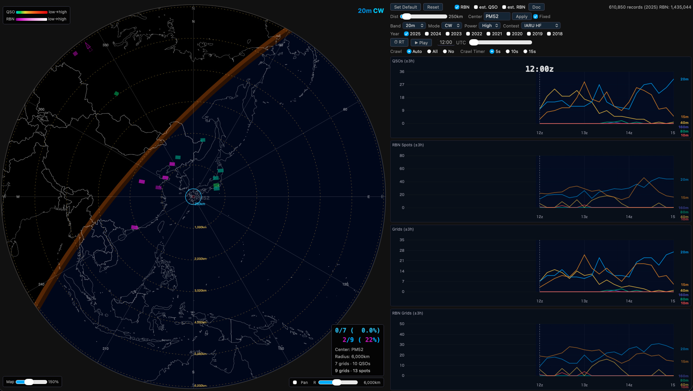

# PropMap

[English README](README.md)

PropMap は、アマチュア無線コンテストの公開ログと RBN（Reverse Beacon
Network）スポットデータをもとに、過去の HF 帯伝搬を自局グリッドロケーター
中心の大圏方位図上でヒートマップ再生するツール。再生時刻を現在時刻に同期
させれば、同時期開催のコンテストで「今の時間帯に過去はどう飛んでいたか」を
参照でき、運用計画やバンドチェンジのタイミング判断に役立つ。

## 特徴

- 公開ログ間でクロスチェック済みの QSO ヒートマップ（双方の局のグリッド
  ロケーターが確認できたもののみ採用）
- CW コンテストでは RBN スポットのヒートマップも表示
- グリッドロケーター未申告局は cty.dat による推定表示（est. QSO /
  est. RBN）に対応 — 古いログのカバレッジを大幅に拡大
- 再生・現在時刻同期（RT）・自動バンド巡回（Crawl）
- 複数年マージ、距離フィルター、グレーライン表示、±3時間アクティビティ
  グラフ
- 対応コンテスト: IARU HF（2018–）、CQ WW CW/SSB（2005–）、
  CQ WPX CW/SSB（2008–）
- データ更新ページ内蔵: 新規公開ログの確認・ディスク使用量見積もり・
  取り込みをブラウザから実行可能

## 必要環境

- Python 3.10 以上 — 見つからない場合は起動スクリプトが同意制で自動導入を
  提案（[uv](https://docs.astral.sh/uv/) 経由。Xcode / Visual Studio /
  Homebrew は不要で、ユーザーディレクトリの外には一切触れない）
- モダンブラウザ（Safari、Chrome、Edge 等）

## クイックスタート

1. 最新リリースの zip をダウンロード（またはこのリポジトリを clone）し、
   `~/heatmap`（macOS/Linux/WSL2）または `%USERPROFILE%\heatmap`
   （Windows）に配置する
2. `start_heatmap.command`（macOS）または `start_heatmap.bat`（Windows）を
   ダブルクリックする
   - macOS の初回のみ: 右クリック →「開く」で Gatekeeper を通す
3. ブラウザが自動的に `http://localhost:8765` を開く

サーバーは 127.0.0.1 のみにバインドされ、他の PC からはアクセスできない。

## データの準備

コンテストデータはサイズが大きいため**同梱されない**。インストール後に
一度構築する:

- **ブラウザから（推奨）:** 地図画面からリンクされている「データ更新」
  ページを開き、公開ログの確認 → ディスク見積もりの確認 → 取り込み実行
- **コマンドラインから:** `cd ~/heatmap/contest_logs && bash generate_all.sh`
  （Windows: `generate_all.bat`）

全コンテスト・全年のフル構築は数 GB のダウンロードと数時間の処理を要する。
お試しであれば 1 コンテスト・1 年から始めるのがよい。

## ドキュメント

- [ユーザーガイド（日本語）](PropMap_UserGuide.md)
- [User guide (English)](PropMap_UserGuide_en.md)

## ライセンス

[MIT](LICENSE)
